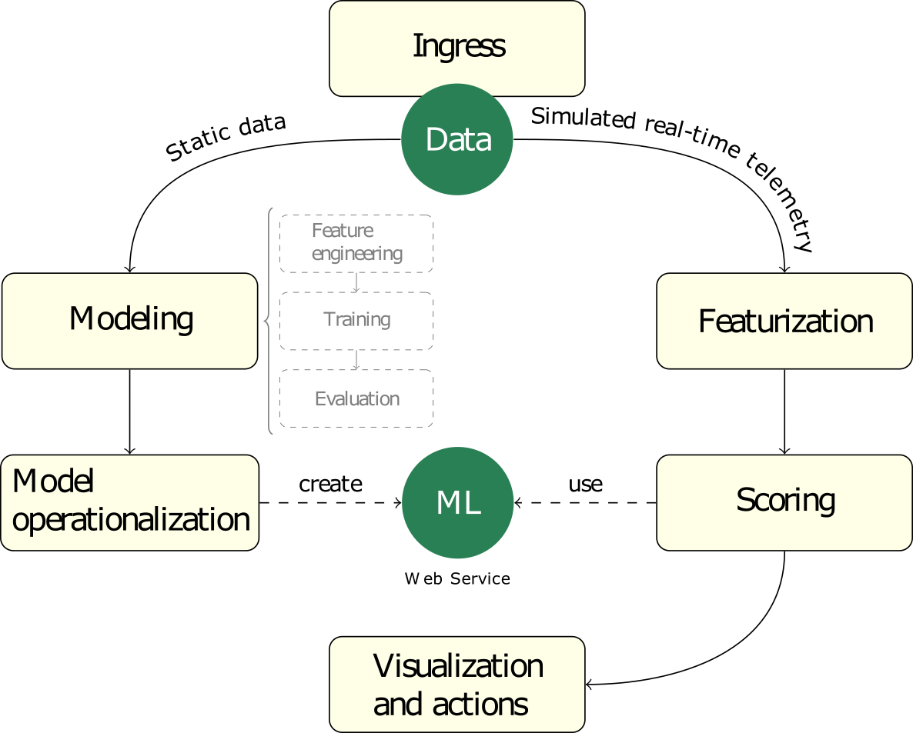

# Introduction
## What is Predictive Maintenance?
Predictive Maintenance (**PdM**) is a popular application of predictive analytics that can help businesses in several industries achieve high asset utilization and savings in operational costs. 

## Predictive Maintenance for Businesses

Businesses require critical equipment to be running at peak efficiency and utilization to realize their return on capital investments. These assets could range from aircraft engines, turbines, elevators, or industrial chillers - that cost millions - down to everyday appliances like photocopiers, coffee machines, or water coolers. 

* by default, most businesses rely on *corrective maintenance*, where parts are replaces a when they fail. Corrective maintenance ensures parts are used completely (therefore not wasting component life), but costs the business in downtime, labour, and unscheduled maintenance requirements (off hours, or inconvenient locations). 
* At the next level, businesses practice *preventive maintenance, * where they determine the useful lifespan for a part, and maintain or replace it before a failure. Preventative Maintenance avoids unscheduled and catastrophic failures. But the high costs of scheduled downtime, under-utilization of the component during its lifetime, and labour remain. 
* The goal of * predictive maintenance* is to optimize the balance between corrective and preventative maintenance, by enabling *just in time* replacement of components. This approach only replaces those components when they are close to failure. By extending components lifespans (compared to preventative maintenance) and reducing unscheduled maintenance and labour costs (over corrective maintenance), businesses can gain cost savings and competitive advantage. 

## Why do businesses need PdM?
Businesses face high operational risk due to unexpected failures and having limited insight into the root cause of problems in complex systems. Some of the key business questions are:

* Detect anomalies in equipment of system performance or functionality.
* Predict whether an asset may fail soon.
* Estimate the remaining useful life of an asset. 
* Identify the main cause of failure of an asset. 
* Identify what maintenance actions need to be done, and when by, on an asset. 

### Typical goal statements from PdM are:

* Reduce operational risk of mission critical equipment. 
* Increase rate of return on assets by predicting failures before they occur. 
* Control cost of maintenance by enabling just-in-time maintenance operations. 
* Lower customer attrition, improve brand image, and lost sales. 
* Lower inventory costs by reducing inventory levels by predicting the reorder point.
* Enable just in time inventory by estimating order dates for replacement parts.
* Discover patterns connected to various maintenance problems. 
* Provide key performance indicators (KPIs) such as health scores for asset conditions. 
* Estimate remaining lifespan of assets. 
* Recommend timely maintenance activities. 

## Qualifying problems for PdM

It is important to emphasize that not all use cases or business problems can be effectively solved by PdM. There are three important qualifying criteria that need to be considered during problem selection:

* The problem must be predictive in nature—there should be a target or an outcome to predict. The problem should also have a clear path of action to prevent failures when they are detected. 
* The problem should have a record of the operational history of the equipment that contains *both good and bad outcomes*. The set of actions taken to mitigate bad outcomes should also be available as part of these records. Error reports, maintenance logs of performance degradation, repair, and replace logs are also important. 
* The recorded history should be reflected in *relevant* data that is of *sufficient* enough quality to support the use case. For more information about data relevance and sufficiency, see [Data requirements for predictive maintenance](https://docs.microsoft.com/en-us/azure/machine-learning/team-data-science-process/predictive-maintenance-playbook#data-requirements-for-predictive-maintenance).
* Finally, the business should have domain experts who have a clear understanding of the problem. They should be aware of the internal processes and practices to be able to support the analyst understand and interpret the data— and they should also be able to make the necessary changed to existing business processes to help collect the right data for the problems, if required.

If you would like develop a better undertanding of the processes involved in developing a model for PdM see (Data Science for predictive maintenance)[https://docs.microsoft.com/en-us/azure/machine-learning/team-data-science-process/predictive-maintenance-playbook#data-science-for-predictive-maintenance].

# Motivation behind this solution template

The intent behind this solution template is to showcase how to put together an end-to-end solution that demonstrates Azure ML modeling and a complete Azure infrastructure capable of supporting PdM scenarios. The components used in this template provide utility on their own and can be re-used and customized to solve other problems. 

# Scenario

The solution deals with a hypothetical IoT-enabled manufacturing environment comprised of generalized rotational equipment, which may include pumps, turbines, gearboxes, compressors, and engines.

The machines are equipped with sensors that transmit telemetry to the cloud in real time. Maintenance logs are also available and, among other things, contain records of failure events indicating exact points in time when a machine had a critical failure of a particular type.

The objective of Predictive Maintenance is to enable businesses to practice *predicitve maintenance*—i.e. enable busiensses to predict failures far a period of time before it happens so they can be replaced. This will reduce costs incurred by replacing equipment too early as well as costs incurred from unscheduled maintenance and labour costs.

# Data acquisition

Real-world run-to-failure datasets are virtually impossible to come across due to their commercially sensitive nature—of the several publicly available synthetic datasets, none ideally fit the canonical IoT scenario in which highly irregular real-time data streams from sensors are captured and used for condition monitoring or anomaly detection. To bypass this a Jupyter Notebook run on a Data Science Virtual Machine (DSVM) is used to generate data that simulates a hypothetical IoT-enabled manufacturing environment comprised of general rotational equipment, which may include turbines and engines. The data generator is capable of producing two datasets of the same format as shown in the diagram below:

* Static seed data for model training
* Real-time telemetry data for performing end-to-end testing and validation of a complete AI-enabled IoT solution. This emulates a realistic production situation where incoming telemetry is staged over an extended period of time in storage blobs, and maintenance logs are accumulated in some other data store (exemplified as a SQL database in the diagram).

# Modeling

Having acquired an input data set, one can proceed to the modelling stage of the data science process.

Modeling is an iterative process consisting of:

* Feature engineering
* Training
* Model evaluation

After selecting the best model according to the evaluation criteria, a data pipeline with scoring can be deployed to a production or production-like environment for final customer acceptance.

In this solution, modeling procedures are implemented as annotated Python 3 [Jupyter notebooks](src/Notebooks). Feature engineering is performed using Spark due to the large volume of data used and for the purpose of exploring and familiaring with Spark's capablities when implementing featurization in production. 

The Notebooks used in this template are run on the compuet targets below:

* Linux Data Science Virtual Machine (DSVM)
* Azure Databricks (feature engineering only)

# Productionalization

## Feature engineering

Feature engineering is the first step prior to modeling the data. A feature is a predictive attribute for the model - such as temperature, pressure, vibration, and so on. For PdM, feature engineering involves abstracting a machine's health over historical data collected over a sizable duration. In that sense, it is different from its peers such as remote monitoring, anomaly detection, and failure detection.
For this reason, designing and building a production data pipeline for a Predictive Maintenance solution can be a relatively non-trivial task.

Generally, predictions can be made either in real time or on a batch basis. This solution was built to support real-time featurization and scoring, which means up-to-date predictions are generated as soon as new data is available.

## Model operationalization

When using Azure Machine Learning (*Internal Preview* as of June 2018), it takes the following steps to operationalize a model:

* Registration
* Docker image creation
* Deployment of the image to a compute target

The end result is a real-time scoring Web service with a REST API interface.

For the purpose of this use case this template includes a pre-trained model, which is deployed to Azure Container Instances (ACI) and used as part of the pre-configured data pipeline to score all new feature data. In the future this default model will be replaced with a customised model more appropriate for the context. 

## Telemetry ingestion and featurization

This solution employs [Spark Structured Streaming](https://spark.apache.org/docs/latest/structured-streaming-programming-guide.html) to perform the featurization of IoT telemetry. The streaming job runs on Azure Databricks.

Briefly, [Azure Event Hubs Connector for Apache Spark](https://github.com/Azure/azure-event-hubs-spark) allows making the *Event Hub-compatible endpoint* of the *IoT Hub* a streaming input source. The streaming job extracts features from the incoming telemetry which is further augmented with the 'historical' static data stored in a data store (e.g., Azure Table Storage). The feature engineering process that takes place in this instance exactly mimics the feature engineering process performed during modeling—the main difference is that here it happens in real time. Take notie of the feedback loop in the diagram below: its purpose is to augment new data with the results of previous aggregations, i.e., the historical data.

This solution's default telemetry ingestion components and output sinks can be replaced with the alternatives shown in the diagram above. IoT Hub's Event Hub-compatible endpoint and a real Event Hub would act exactly the same in this scenario, so integrating with an Event Hub would not require any additional work. Introducing other alternatives such as an Azure SQL Database will require code changes.

### Can feature engineering be done using Azure Stream Analytics (ASA)?

 ASA may be a viable option in some relatively simple scenarios. It wasn't used in this soloution for several reasons:
 
 * This use case was partially carried out to explore Databricks and Spark's capabilities as well as using Databricks alongside a DSVM.
 * inability to write unit tests for ASA queries
 * difficulties processing irregular streams of data
 * difficulties accessing the historical data
 * having access to code which implements feature engineering on Spark. This will need to be re-written from scratch for use on ASA.  (previously done on Spark) from scratch

## Scoring, visualization and actions

New feature data, stored in an Azure Storage table by the featurization job, is passed to the operationalized model to generate predictions. This process is orchestrated by a Web Job, which runs independently from the featurizer (this is done to promote better modularity and separation of concerns). Predictions are written to another Azure Storage table. The Dashboard, or a different visualization and reporting tool (e.g., Power BI), can access and render both the predictions and real-time aggregates which are computed by the featurizer.

Note: the diagram shows the real-time machine learning Web service running on Azure Kubernetes Service (AKS)—in the default configuration, however, it is deployed to Azure Container Instances (ACI). While both options are acceptable, AKS is usually preferred in production, whereas ACI typically serves as a light-weight developing/testing option.

